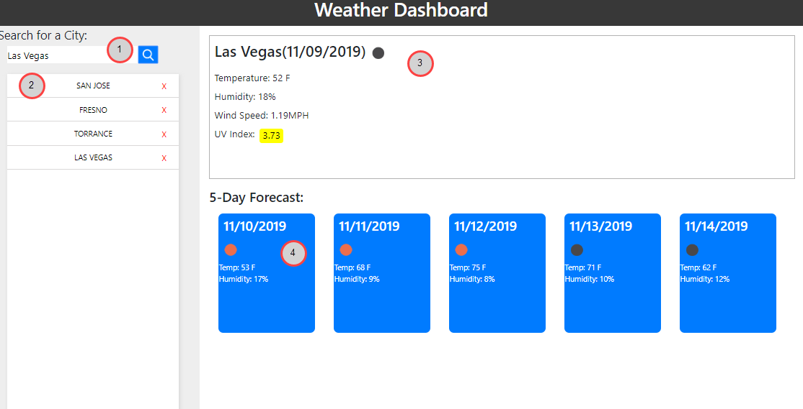
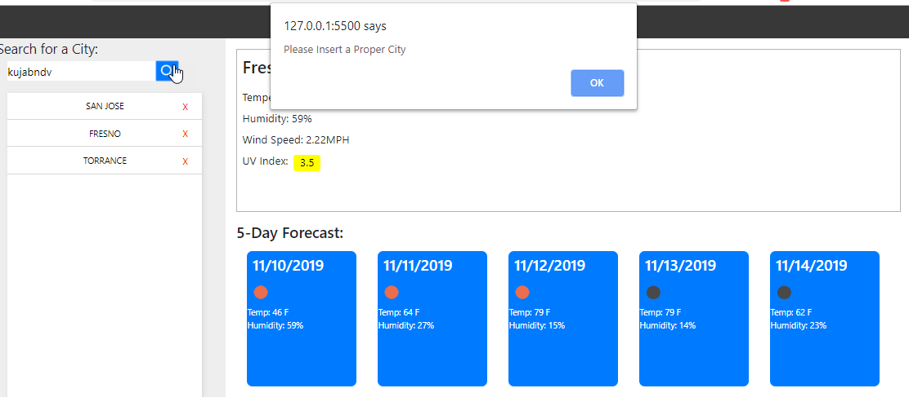

# hw6weatherApp

# Weather Dashboard

## Table of Contents
- Summary
- Instructions
- Additional Information

# Summary

---

### Referring to the points in the image above:
1) Input for city names, once a term is searched, it will become the focus of the dashboard
2) The buttons in list represent previously selected cities. They can be clicked to active the city in the dashboard
3) Main Content Area used to display todays weather of the selected city. Shows Temperature, Humidity, Wind Speed and the UV Index. The icon to the right of the date can be used to understand current weather conditions. 
4) 5 day forecast of the selected city. Current weather condition, temperature and humidity are shown. 

# Instructions
To see the current weather of the city, add the city by typing it in and clicking the search icon.If it is a new title, it will be added to your local list. This list will persist as part of your localhost, so this mean your items will always remain in memory even if you close the browser. If there is already a city in your list, you can click it to see that cities data. 

# Additional Information

If you insert a city that does not exist in the database, it will return and error and there won't be a city added to your list.

You can delete cities from your list by pressing the red X.